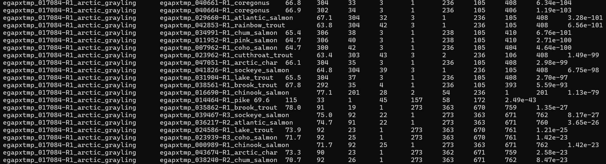
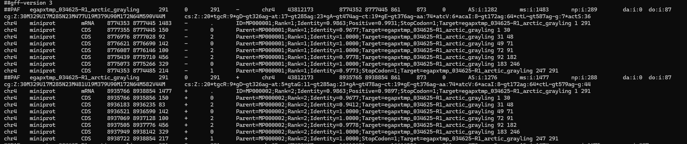
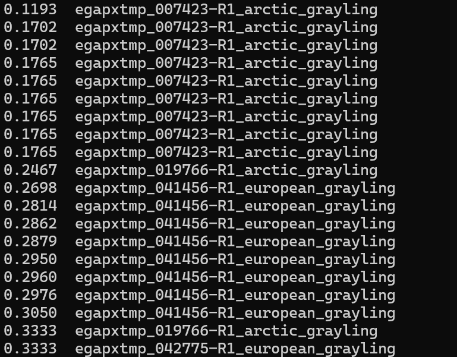

# PEQG 2026 Pangenome Salmonid PAV Tutorial
This is a quick tutorial on finding gene presence absence variants (PAV) in family level analysis with alignment methods (BLAST and miniprot). 

## Introduction ##

Salmonids are a highly diverse group of long-lived, coldwater fishes with divergence times of up to 100 mya. This family shares a salmonid specific whole genome duplication event (termed the Ss4R) that occured ~88-100 mya). Species in this lineage are in various stages of rediploidization, meaning some parts of their genome are still partially tetraploid. In my study, I am focused on finding gene PAVs, particularly those that might exist in one genus (Thymallus) for which I have three assemblies, compared to 11 other species of salmonids. My specific questions included:

1. What gene PAVs do graylings possess (Arctic grayling, Amur grayling, european grayling) in comparison to a subset of the salmonid family?
2. What might these PAVs tell us about their unique life history strategies, or the unique environments they inhabit?

Most pangenome tools (Minigraph cactus, PGGB, PanTools) are designed for constructing pangenomes either witin species, or genus. While progressive cactus is designed for more broad comparisons (potentially at the family level) extensive divergence and distance can across individuals included in the pangenome can lead to issues during the alignment stage. To approach this, I took a gene family based approach followed by further alignment methods for PAV identfication. This involves a quick BLAST/diamond run to understand sequence similarity, and then a protien to genome alignment (miniprot) to check if genes with low sequence similarity might exist in your other genomes. Finally, they are used in conjunction with OrthoFinder and synteny analysis for further validation. 

If you want to do this on your own data you would need:

1. Protien files (.faa, .pep) for all of your indviduals - generated from annotation
2. Assemblies for each (.fasta)
3. A database created from the protiens (.dmnd) which I'll describe how to create
4. An OrthoFinder run
5. A functional annotation 


## A Note Before You Start on Annotation and Assembly Quality ##

In comparative studies, annotation quality is imperative. Before the below analysis, all genomes were re-annotated with the same verison of EGAPx. EGAPx provided structural annotations, and I used EnTAP for functional annotations (https://entap.readthedocs.io/en/latest/). It is known that re-annotation with the same tool often resolves issues in detecting PAV that would arise if one were to use annotations generated across different tools / pipelines. Consistent methodology during annotation is known to decrease the incidence of detcting false PAVs specifically (Bruna et al. 2026). See this paper for more information: https://academic.oup.com/nargab/article/8/1/lqag011/8445264

As mentioned, all assemblies used here were re-annotated with EGAPx, the public verison of NCIB's Eukaryotic Genome Annotation Pipeline (https://github.com/ncbi/egapx). This has been performing well for vertebrates in our lab, if you are annotating plant genomes, take a look at EASEL (Efficient, Accurate, Scalable Eukaryotic modeLs) which was developed by Cynthia Webster in Dr. Jill Wegrzyn's lab at the University of Connecticut: https://gitlab.com/PlantGenomicsLab/easel. 

Further, ensure you are using as high-quality genomes as possible, which are both complete and contigious.

 ### Analyes performed before this tutorial ###

Before I searched for PAVs I:

1. Ran Orthofinder to evaluate OrthoFinder to identify both orthologs and paralogs (https://link.springer.com/article/10.1186/s13059-019-1832-y)

Before OrthoFinder and PAV analysis, the longest isoform was obtained for each gene. This means there is 1 representive protien for each gene in the analysis. See this script: SCRIPT HERE for extracting this from your protein files. 

2. Functionally annotated all genomes to understand gene functions 

 
### Input data ###

I have uploaded all the protien files, and assemblies here for use. Here are the species (I have one assembly and annotation for each):
1. Arctic grayling (*Thymallus arcticus*)
2. European grayling (*Thymallus thymallus*)
3. Amur grayling (*Thymallus grubii*)
4. Northern pike (*Esox lucius*) - outgroup species
5. Cisco (*Coregonus artedi*)
6. Atlantic salmon (*Salmo salar*)
7. Arctic char (*Salvelinus alpinus*)
8. Brook trout (*Salvelinus fontinalus*)
9. Lake trout (*Salvelinus namaycush*)
10. Rainbow trout (*Oncorhynchus mykiss*)
11. Cutthrout trout (*Oncorhynchus clarkii*)
12. Coho salmon (*Oncorhynchus tshawytscha*)
13. Sockeye salmon (*Oncorhynchus nerka*)
14. Chum salmon (*Oncorhynchus keta*)
15. Pink salmon (*Onchorhynchus gorbsucha*)


### Required Software ###

- miniprot
- diamond (faster than BLAST)
- seqkit 

### Installation ###

miniprot
```
git clone https://github.com/lh3/miniprot
cd miniprot && make
```

diamond
```
wget http://github.com/bbuchfink/diamond/releases/download/v2.2.1/diamond-linux64.tar.gz
tar xzf diamond-linux64.tar.gz
```
seqkit
```
conda install -c bioconda seqkit
```

### Step 1: Assess Sequence Similarity ###


First, we want to create a database of all the species we are going to compare to. In this case, I am BLASTing all *Thymallus* protiens against the protiens of all the other salmonids. This will give us an idea of which genes may or may not align, and provide insight into finding putative PAVs.
Download the ```all_non_grayling_salmonids.pep ``` file, which we will use to create the DIAMOND database.

Create the database:
```
#everything except graylings
diamond makedb \
  --in all_non_grayling_salmonids.pep \
  -d non_grayling_salmonids
```

The output of this is our database: ```non_grayling_salmonids.dmnd ```

Next, we will perform the sequence similarity search. ```grayling_all_query.pep``` is all of the ***Thymallus***, or grayling, protiens. It will align all of these to every other salmonid. 

```
#blast all grayling protiens against all other salmonids
diamond blastp \
    -q grayling_all_query.pep \
    -d non_grayling_salmonids.dmnd \
    -o all_grayling_against_salmonid_pangenome.txt \
    -e 1e-10 \
    --more-sensitive \
    --max-target-seqs 50 \
    --outfmt 6 qseqid sseqid pident length mismatch gapopen qstart qend sstart send evalue
```



We now have our sequence similarity results. We will compare all the grayling genes that went into the search, with the BLAST results to _find genes that did not align whatsoever_. 

The steps for this include:
1. Pulling all grayling IDs (from ```grayling_all_query.pep ``` into a list (.txt)
2. Pull the first column of the blast (grayling IDs that did align).
3. Compare and output genes that didn't align

```
grep ">" grayling_all_query.pep > all_grayling_ids.txt
cut -f1 all_grayling_against_salmonid_pangenome.txt | sort | uniq > blast_query_ids.txt
comm -23 all_grayling_ids.txt blast_query_ids.txt > grayling_nohit_genes.txt
```
The last line will output a file that contains the genes that are in the original search set, but not in the BLAST results, meaning they didn't align. 
The output is just a list of genes, so I won't show it, but there are 377. These are our putative gene candidates. Next, we will pull these gene IDs from our origianal protein file to have a new, candidate gene protien set. 

```
seqkit grep -f grayling_nohit_genes.txt  grayling_all_query.pep > best_candidate_pav_genes.pep 
```

Now you have genes for miniprot - the next section!


### Step 2: Protien to Genome Alignmnet ###

We need to align our ```best_candidate_pav_genes.pep``` file to all of our salmonid genomes. Even if they didn't align, we still need to check with a protein to genome alignment. We will do this against all other salmonids, and the input set to compare grayling vs. grayling alignments. Specifically, I was interested to see if there were any genes present all graylings (Arctic, European, and Amur) but not in the other salmonids.

```
atlantic_salmon=/core/projects/EBP/Wegrzyn/EVOME/thymallus_arcticus/02_Analysis/compare_genomes/atlantic_salmon/atlantic_salmon_29chrs_renamed.fasta
euro_grayling=/core/projects/EBP/Wegrzyn/EVOME/thymallus_arcticus/02_Analysis/compare_genomes/european_grayling/european_grayling_chrs_renamed.fasta
arctic_grayling=/core/projects/EBP/Wegrzyn/EVOME/thymallus_arcticus/02_Analysis/repeats/repeatmasker_out/hap1_male_hifiasm_haphic_masked_renamed.fasta
amur_grayling=/core/projects/EBP/Wegrzyn/EVOME/thymallus_arcticus/02_Analysis/synteny/grayling_genus_synteny/genomes/amur_grayling_46chrs_renamed.fasta
arctic_char=/core/projects/EBP/Wegrzyn/EVOME/thymallus_arcticus/02_Analysis/compare_genomes/arctic_char/arctic_char_39_chrs_renamed.fasta
chum_salmon=/core/projects/EBP/Wegrzyn/EVOME/thymallus_arcticus/02_Analysis/compare_genomes/chum_salmon/chum_salmon_37chr_renamed.fasta
lake_trout=/core/projects/EBP/Wegrzyn/EVOME/thymallus_arcticus/02_Analysis/compare_genomes/lake_trout/lake_trout_42_chroms_renamed.fasta
pink_salmon=/core/projects/EBP/Wegrzyn/EVOME/thymallus_arcticus/02_Analysis/compare_genomes/pink_salmon/pink_salmon_27_chrs_renamed.fasta
rainbow_trout=/core/projects/EBP/Wegrzyn/EVOME/thymallus_arcticus/02_Analysis/compare_genomes/rainbow_trout/rainbow_trout_33chr_renamed.fasta
sockeye_salmon=/core/projects/EBP/Wegrzyn/EVOME/thymallus_arcticus/02_Analysis/compare_genomes/sockeye_salmon/sockeye_salmon_chroms_only_renamed.fasta
brook_trout=/core/projects/EBP/Wegrzyn/EVOME/thymallus_arcticus/02_Analysis/compare_genomes/brook_trout/brook_trout_42_chrs_renamed.fasta
cutthroat_trout=/core/projects/EBP/Wegrzyn/EVOME/thymallus_arcticus/02_Analysis/compare_genomes/cutthroat_trout/cutthroat_trout_33chrs_renamed.fasta
coregonus=/core/projects/EBP/Wegrzyn/EVOME/thymallus_arcticus/02_Analysis/compare_genomes/coregonus_artedi/coregonus_artedi_chrs_renamed.fasta
coho_salmon=/core/projects/EBP/Wegrzyn/EVOME/thymallus_arcticus/02_Analysis/compare_genomes/coho_salmon/coho_salmon_30_chrs_renamed.fasta
chinook_salmon=/core/projects/EBP/Wegrzyn/EVOME/thymallus_arcticus/02_Analysis/compare_genomes/chinook_salmon/chinook_34_chrs_renamed.fasta


miniprot -t8 --gff $atlantic_salmon best_candidate_pav_genes.pep > atlantic_grayling_pav_validation.gff
miniprot -t8 --gff $amur_grayling best_candidate_pav_genes.pep > amur_grayling_pav_validation.gff
miniprot -t8 --gff $arctic_char best_candidate_pav_genes.pep > arctic_char_grayling_pav_validation.gff
miniprot -t8 --gff $chum_salmon best_candidate_pav_genes.pep > chum_salmon_grayling_pav_validation.gff
miniprot -t8 --gff $lake_trout best_candidate_pav_genes.pep > lake_trout_grayling_pav_validation.gff
miniprot -t8 --gff $pink_salmon best_candidate_pav_genes.pep > pink_salmon_grayling_pav_validation.gff
miniprot -t8 --gff $rainbow_trout best_candidate_pav_genes.pep > rainbow_trout_grayling_pav_validation.gff
miniprot -t8 --gff $sockeye_salmon best_candidate_pav_genes.pep > sockeye_salmon_grayling_pav_validation.gff
miniprot -t8 --gff $brook_trout best_candidate_pav_genes.pep > brook_trout_grayling_pav_validation.gff
miniprot -t8 --gff $cutthroat_trout best_candidate_pav_genes.pep > cutthroat_trout_pav_validation.gff
miniprot -t8 --gff $coregonus best_candidate_pav_genes.pep > coregonus_grayling_pav_validation.gff
miniprot -t8 --gff $coho_salmon best_candidate_pav_genes.pep > coho_salmon_pav_validation.gff
miniprot -t8 --gff $chinook_salmon best_candidate_pav_genes.pep > chinook_salmon_pav_validation.gff

#grayling to grayling
miniprot -t8 --gff $arctic_grayling best_candidate_pav_genes.pep > arctic_grayling_pav_validation.gff
miniprot -t8 --gff $euro_grayling best_candidate_pav_genes.pep > european_grayling_pav_validation.gff

cat *gff > all_species_miniprot_hits.gff
 
```
Here is what it looks like:



From left to right, the first column where the hit was identified, the location of the alignment, the percent identity, and the gene ID that aligned.

Now, we want to filter by the lowest percent identity alignments. Again, these are genes that didn't align during BLAST, and have low protien to genome alignments in the other salmonids, increasing the confidence that they could be PAVs.

Filter by the lowest alignments (by percent identity):

```
awk -F'\t' '$3=="mRNA" {
    match($9,/Identity=([0-9.]+)/,a)
    match($9,/Target=([^ ]+)/,b)
    print a[1] "\t" b[1]
}' all_species_miniprot_hits.gff  | sort -g -k1,1 | head -20 > lowest_alns_pav.gff

```

Results:



There are 20 candidates here. As a sanity check, we can grep these IDs and make sure the alignments are all low percent identity in all non-grayling salmonids. Since we have a GFF for each we can check. This one ```egapxtmp_007423-R1_arctic_grayling```  is low across the board after independently checking each species GFF.

Lets just test that ID for now:

```
grep "egapxtmp_007423-R1_arctic_grayling" *.gff > check_all_species_test_candidate.gff

```
[Checking results output] (https://github.com/Airianna25/PEQG_2026_Pangenome_Salmonid_PAV/blob/main/check_all_alns.gff)

What we see, is that we have very high quality alignmnets to the arctic grayling (as expected!), european grayling, and the amur grayling. In both the rainbow trout, cut-throat, cogo, and chum salmon, we see an alignment rate of ~17, but no alignments whatsoever to other species. This could indicate that it's uniquely present in graylings. 

### Step 5: Evaluate gene function ###

Lets check this gene function in our EnTAP functional annotation

```
grep "egapxtmp_007423-R1_arctic_grayling" > ag_entap_results.tsv
```

This is putatively annotated as a lipid binding gene. However, it doesn't have any GO terms associated and the annotation is quite broad, just from Eukaryota and no further classifications. 


### Step 4: Further Validation###

1. Reciprocal blast
2. OrthoFinder group membership
3. Synteny


### Step 5: Further analysis with identified PAVs ###

### Power of this approach compared to other methods ###

The use of BLAST, reciprocal blast searches, protien to genome alignment, OrthoFinder, and synteny in combination with eachother will all provide further support for PAVs. This is a pseudo-pangenome approach for species with a wide evolutionary distance, that might not work well with typical pangenome tools. Ideally, these analyses should be used together to validate candidates in the absence of a typical pangenome
graph. BLAST and protien to genome alignment will give you information about sequence similarity and potentially diverged copies that could look like PAV at a glance, while following up with OrthoFinder will give insight into orthologous and paralogous relationships. Looking at the syntney of these PAV regions across your genomes can provide resolution on potential translocation events, gaps, relationships of orthologous regions, all which can interfere with intepretation of PAVs. 

In salmonids, differential retention of duplicated genes (ohnologs) can appear to be PAV, especially given the salmonid-specific whole genome duplication event. Therefore, it's important to cross-check candidates with several methods.


## Caveats ##

Gaps or errors in assembly could present as gene PAVs. Here, this was controlled by ensuring all assemblies used were complete (95% complete). Further, all potential PAVs are checked to make sure coordinates would not fall into a gap region (when assessing where that gene might align in your other genomes). This is also controlled by verifying the gene exists in other graylings. If a gene exists in all 3 graylings, but not in other salmonids, there is stronger support for it being a PAV, and not an assembly or annotation artefact. Lastly, a consistent annotation method for all can help reduce false positives. 


